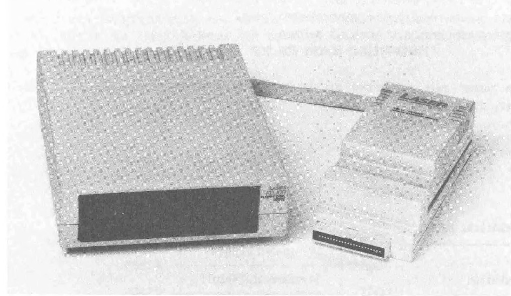

Installation of the floppy disk system
======================================

In principle, all connections of electronic components should only be made or
released when the power supply is switched off. Otherwise, how quickly is an
expensive fully integrated component destroyed by voltage peaks that occur.

This also applies to the connection of the floppy disk system. So make sure that the
power supply of the computer system is turned off.

The floppy disk controller is first connected to the system bus on the back of the
computer. This is the plug strip to which a possibly existing memory extension was
connected. You can now connect it to the top of the floppy disk controller.
There are two 20-pin connector strips on the back of the floppy disk controller
to connect the drives, they are marked "D1" for drive 1 and "D2" for drive 2

If you only have one drive, connect it to "D1".

Each drive requires a separate power supply. The 5-pin DIN plug of the power
supply unit must be plugged into the corresponding socket on the back of the drive.

Now connect the power packs to a mains socket and your setup is complete.
You should make sure that there is no diskette in the drive when making or breaking
the power connection, as this could possibly destroy the data content.

You should always disconnect the power supply from your floppy disk drives if you
will not be using the system for a long period of time.

It is advisable to procure a 220 volt plug strip with an illuminated on/off switch for all
mains connections of the computer system. This way you can interrupt the entire
power supply when you have finished your work by simply pressing a button.

Remember that the LASER 110 and VZ200 computers with 4K internal RAM must
have at least a 16K memory expansion.

	Figure 1.8 Floppy disk drive, 16K memory expansion and floppy disk control

