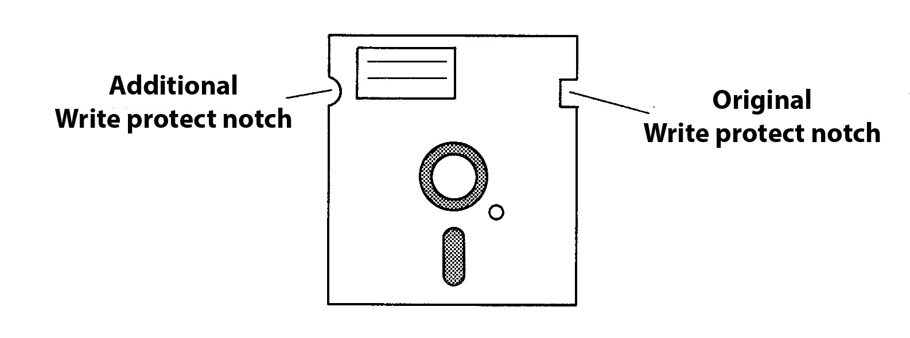

The floppy disk
===============

Construction
------------

Due to the fact that the disk is pressed against the read/write head, it is evident that
no solid disk can be used as the base material. A flexible, dimensionally stable
plastic material (usually a mylar sheet) is used that is coated with iron oxide. This is
where the English name "floppy disk" comes from.

For better handling and to protect the coating, the disc is packed in a rigid sleeve
with a felt-like lining.

The lining fulfills three essential tasks:

* Reducing friction between disk and case
* Dissipate static charges caused by rotation
* Absorption of dust and dirt particles that have penetrated to protect the coating

The diskette stays in this sleeve at all times, which has three openings for handling:

* a large hole in the middle for the drive mechanism
* an oval cutout through which the head on the coating can access
* a small opening as an index hole, which is used by many drives to physically identify the start of a track (not by the **LASER DD20**).

There is a small rectangular recess on the back of the case. This is device
write-protection that you can use to protect the contents of a floppy disk. 
If this gap is covered with one of the adhesive strips supplied with the floppy disk
packaging, writing to this floppy disk is blocked. (Figure 1.4).

	Figure 1.4 Floppy disk

The actual data carrier only consists of a very thin coating of iron oxides and is
specially treated in order to be able to remain in contact with the read/write head for
a reasonable length of time. Nevertheless, this layer is abraded over time with
constant head contact. A running time of 50 - 60 hours can serve as a guide. This
results in a fairly long service life, since the disk only runs for read/write access and
the head is not always on the same track.

Because of this abrasion, malicious gossip also refers to diskette processing as
"cutting data technology".

.. _Inserting a floppy disk:

Insert the disk
---------------

To insert a floppy disk, the locking lever on the drive opening is set horizontally. The
floppy disk is now pushed into the drive until it stops, with the oval head cutout to the
front and normally with the label facing up.

Turning the locking handle to the vertical position presses the drive hole on the
floppy disk centered on the drive cone of the drive and presses the floppy disk
against the read/write head.

Normally this is sufficient and the read/write operations can begin.
However, as previously mentioned, difficulties can arise when the disk is crookedly
clipped onto the cone, and unfortunately this often happens with the **LASER DD20**.
You should therefore make the following points a rule:

* Use only floppy disks with a reinforcement ring around the drive shaft. This prevents premature wear on the drive hole due to crooked pinching on the cone.
* Before inserting the disk, center it by hand as best you can in the case.
* Before writing anything to an initialized floppy disk, test it with the DIR command.
* After reinitialization, remove the diskette, reinsert it and also test with the DIR command.
  
If, despite this, the Drive keeps trying to reposition the head during a read process
(you can hear this from the slightly louder clicking noises), open the locking lever
briefly with the motor running and close it again immediately. As a rule, the disk pulls
cleanly onto the cone when the engine is running.

A floppy disk has two sides
---------------------------

Which diskettes do you now obtain for the **LASER DD20**?

As mentioned, this is a 5 1/4 inch drive, so you will also need 5 1/4 inch floppy disks.
But there are also many different types, hard sectored or soft sectored, one-sided or
double-sided, with single density or with double density,

To sum it up! You will need 5 1/4 inch, soft sectored, single sided, single density
floppy disks. These bear the designation "SSSD"; this stands for "single sided, single
density".

You can also use double-density floppy disks (SSDD). These have been tested a
little more thoroughly, are a bit more expensive, but are not absolutely necessary for
the recording process used with the **LASER DD20**.

If you look closely at such a "single-sided" diskette, you will notice that both sides are
coated and that the oval opening for the head is also present on both sides of the
case.

This means that in principle you can write to both sides of the disk.

However, the **LASER DD20** drive is equipped with only one read/write head. So you
had to turn the disk to bring it to the other side. If you do this and now try to write
something on this side, you will get the message :ref:`?DISK WRITE PROTECTED <Error Messages>`.
This is due to the lack of a write protect notch on the other side of the case.
Remember that a floppy disk is write-protected when you tape over the write-protect
notch.

"No write-protect notch” obviously has the same effect.

In order to be able to use the second side, only a second write protection notch is
required, which you can easily attach to the case with a hole punch. Use another
disk as a template. Don't worry about damaging the disk itself, it doesn't reach that
far into the corners of the case (Figure 1.5).

	Figure 1.5 Double-sided use of the floppy disk

You have now created 80,000 bytes of additional storage space per diskette.
However, you should turn the disk over if you want to read or write to the back.

Handling of floppy disks
------------------------

In order to protect your data on the floppy disks from destruction as much as
possible, you should absolutely observe the following rules:

* Always keep floppy disks in their protective cases when they are outside the drive.
* Make sure there is no disk in the drive when turning the power on or off.
* Never bring your floppy disks close to strong magnetic fields 
  (transformers,motors, magnets, televisions/monitors, radios, etc.); 
  the magnetic fields emitted there could destroy the data content.
* Only touch the disk by the sleeve. Avoid touching the magnetizable coating. Also try to clean the coating. Scratches are quick in the surface and you can then forget about the disk.
* Never expose a floppy disk to direct sunlight or excessive heat.
* Avoid contaminating the coating with cigarette ash, dust or other things.
* Only use a fiber pen if you want to write on the label on the case. Ballpoint pens or pencils could damage the coating through the case.
* Whenever possible, store floppy disks upright (like vinyl records) so that there is no pressure on the sides.

Tips on disk labeling.

Each floppy disk has a label permanently affixed to its case. You should only use this
for important information that does not change during the life of a floppy disk. For
example, it is very helpful to give the diskettes a consecutive number for archiving.
This would have its best place there. Other useful data include your name and the
date the disk was first used.

For information on contents, it is best to use the adhesive labels enclosed with each
pack of disks, which you can also easily change once in a while. If you do not use
them to seal any important openings, you can use the entire surface of the case for
this purpose.

Record structure
----------------

What determines the amount of data that can be stored on a floppy disk? Each
system has its own disk storage capacity; with the 5 1/4 inch floppy disks this is
possible up to 1/2 million bytes (characters) per disk side. With the **LASER DD20** it is
slightly more than 80000 bytes.

Two key factors affect storage capacity. This is the number of increments with which
the head moves over the floppy disk and which is equal to the number of data tracks
to be written on the floppy disk. There are currently Known to vary between 35 and
89 on different systems.

The **LASER DD20** has 40 tracks.

The second factor is the way each bit is written to disk. A distinction is made here
between “single density” (FM) and “double density” (MFM). Double recording density
also results in approximately twice the capacity. As already mentioned, the LASER
DD20 records with single density.

However, the storage capacity could be almost twice as large if the data were written
to the floppy disk exactly as they are in the memory without any further measures
being taken. With this you get a lot of data on the diskette, but you can't do much
with it anymore. How could you find out a specific piece of information in a jumble of
bits without having to go through everything from the beginning.

The benefits of disk storage are realized only when the records are organized in a
meaningful way by breaking them into small manageable chunks that have a known
location on the disk. This is the only way to take advantage of direct access. This
means nothing other than that you have to format the recordings.

Such formatting is achieved by dividing the recording on the disk within the 40
different tracks into 16 equal sections (sectors), like a pie. Each of these sectors is
separately addressable and can be treated individually.

Each track consists of 16 sectors, in each of which 128 data bytes can be
accommodated (Figure 1.6). For the **LASER DD20** this means a precise storage
capacity of

	48 tracks x 16 sectors x 128 bytes = 81920 bytes

per disc side.

	Figure 1.6 Arrangement of tracks and sectors on a floppy disk

However, this is not all that needs to be stored on a formatted floppy disk
Among other things, to be able to access a sector directly without any major fuss,
mап must know when the information you are looking for is passing under your
head.

For this purpose, each sector receives a header, a so-called address field, in which
the sector number and, in order to recognize head alignment errors, also the track
number are noted.

To detect recording errors within a sector, a checksum field is added at the end of the
sector.

But this alone is not enough. The head is rarely at the point where a new byte begins
on the track. As a rule, it will start reading in the middle of a byte. However, since the
data is stored consecutively bit by bit without gaps, it is impossible to identify the
beginning of a byte. That is, first of all, a start of recording is found. One speaks here
of a synchronization of the head.

For this purpose, specially defined bit sequences and recording marks are written
onto the diskette, which have an easily recognizable pattern.
There are two different types of these marks. One precedes each sector address
field, which is the "address mark"; a second precedes 'each data field of a sector, the
"data mark".

Each of these markers are preceded by sync bytes, and the markers are
immediately followed by the data. This allows one to clearly distinguish whether one
is in front of a data record or in front of an address field.

Further space is lost on the floppy disk due to "recording gaps" located behind each
data field of a sector. These gaps are urgently needed in order to be able to
compensate for fluctuations in the rotational speed within certain limits (Figure 1.7).
Such a basic structure of the diskette must first be created before any data is written
to it. This process is called "initialization"; a separate command is available for this.
During initialization, the subdivision into sectors is carried out and all address and
data marks are written.

	Figure 1.7 Data structure on a floppy disk

Figure 1.6 shows that the sectors are not numbered consecutively from 1 to 16, but
in jumps on the diskette. With this little trick, it is possible to read several sectors in a
row during one revolution of the diskette and thus speed up access considerably.

After these explanations it should be understandable how the computer can find
every single sector on the diskette.

However, you usually don't want to know anything about individual sectors, you are
looking for a specific program on the diskette or a file that you have created there. As
a rule, you will also have more than one program or file stored on a diskette. How do
you get such a complete record without having to keep track of sectors yourself?

A whole track of the floppy disk was sacrificed for this purpose. On track 0, the
outermost track, there is a table of contents on the diskette, in which it is recorded
which programs and files are stored on the diskette and where they can be found.
With the DOS command "DIR" you can display this table of contents on the screen.

The last sector of this track 0 still has a special use. It notes whether each sector of
the diskette is free or contains valid data.

