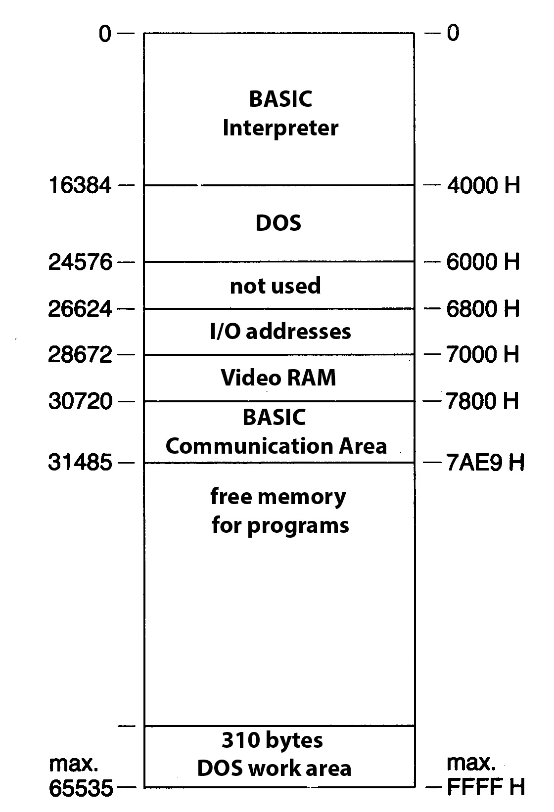

Structure of the LASER-DOS
==========================

The LASER floppy disk operating system, DOS for short (Disk Operating System), is
an additional program package of approx. 8 KB that has been accommodated in
ROM modules in the housing of the Floppy Ddisk Controller.

It includes the memory area from address 16384 (4000Н) to address 24575
(5FFFH), which is kept free in the LASER computers for such expansion purposes
(Figure 2.1).

	Figure 2.1 The memory allocation of the LASER 110, 210, 310 and the VZ200

When the computer is switched on, the existence of the floppy disk operating system
is automatically recognized by the initialization routine of the standard ROM and
initialized, i.e. embedded in the BASIC interpreter's sequence routines.

The floppy disk operating system has its own command interpreter, which
independently recognizes the :ref:`17 additional input commands <DOS commands>` 
and initiates its own execution routines.

The additional commands are exclusively floppy disk operations that enable you to
save and retrieve programs and also to manage your own data stocks on the floppy
disk.