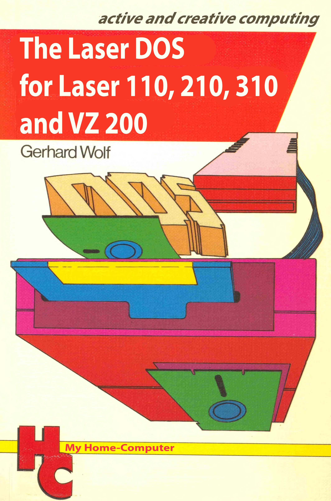

.. Laser310/VZ300 DOS 1.2 documentation master file, created by
   sphinx-quickstart on Sun Apr  2 12:49:47 2023.
   You can adapt this file completely to your liking, but it should at least
   contain the root `toctree` directive.

Laser 310/VZ300 DOS 1.2
=======================

	
 	1st edition by Gerhard Wolf, VogelBook Publishing, 1985

.. toctree::
   :maxdepth: 3
   :caption: Table of Contents:
   
   test
   Chapter0/index
   Chapter1/index
   Chapter2/index
   Chapter3/index
   Chapter4/index
   Chapter5/index
   Chapter6/index
   Chapter7/index
   Chapter8/index
   Chapter9/index

Indices and tables
==================

* :ref:`genindex`
* :ref:`modindex`
* :ref:`search`
